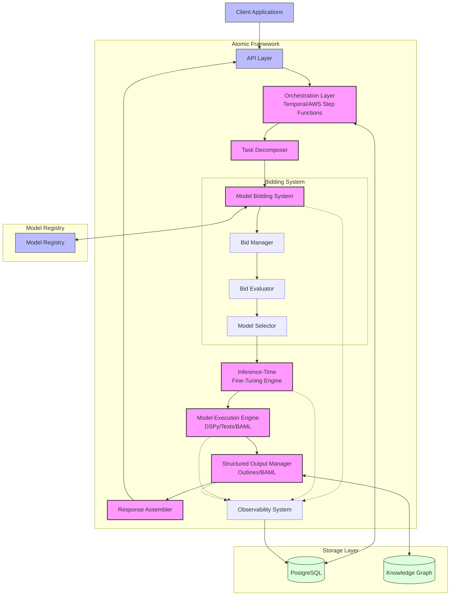
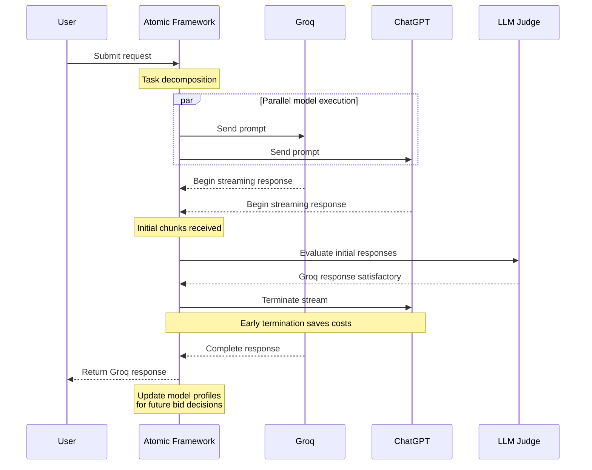

# Atomic

**Dynamic AI Orchestration with Model Bidding and Runtime Optimization**

Atomic is an enterprise-grade AI orchestration framework that revolutionizes model selection and execution through a real-time bidding system. It enables AI models to compete for microtasks based on efficiency metrics, dynamically adapts models at runtime without retraining, and provides comprehensive observability with type-safe outputs.

## 📌 Executive Summary

Atomic addresses critical challenges in production AI systems:

- **Model Capacity Constraints**: Startups and enterprises often face limited access to high-demand models like Claude and GPT-4, creating bottlenecks in AI-powered applications
- **Latency Management**: Traditional AI systems suffer from unpredictable or high latency, compromising user experience and real-time applications
- **Black Box Operations**: Many orchestration frameworks like ReAct and CrewAI operate as black boxes, making it difficult to understand decision paths and troubleshoot issues
- **Output Unpredictability**: AI systems frequently produce inconsistent or unexpected outputs, creating reliability challenges for production deployments
- **Intelligent Routing**: Atomic provides dynamic model routing based on real-time performance metrics, ensuring optimal task allocation
- **Resilient Fallbacks**: Automatic fallback mechanisms seamlessly transition to alternative models when primary options fail or underperform
- **Resource Optimization**: Sophisticated cost management dynamically balances performance needs with budget constraints

## Benefits
- **Cost Efficiency**: Automatically select the most efficient model for each specific task
- **Runtime Adaptation**: Fine-tune models during execution without costly retraining
- **Type Safety**: Ensure reliable, structured outputs with schema validation
- **Enterprise Readiness**: Support compliant execution for regulated industries
- **Full Observability**: Understand exactly why each model was selected and how it performed

## 🏗️ Architecture Overview



The diagram illustrates the key components of Atomic's architecture:

1. **Client Interface**: Applications interact with Atomic through the API layer
2. **Orchestration Layer**: Coordinates workflow using Temporal or AWS Step Functions
3. **Task Decomposer**: Breaks complex requests into atomic microtasks
4. **Model Bidding System**: Core innovation where models compete for microtasks
5. **Inference-Time Fine-Tuning Engine**: Adapts models at runtime without retraining
6. **Model Execution Engine**: Executes selected models using frameworks like DSPy, Texts, BAML
7. **Structured Output Manager**: Ensures type-safe, schema-validated outputs
8. **Observability System**: Provides comprehensive visibility into execution paths

## ⚙️ Technology Stack

| **Component**     | **Technology**                     | **Purpose**                                  |
|-------------------|------------------------------------|----------------------------------------------|
| Orchestration     | Temporal OR AWS Step Functions     | Workflow coordination and state management   |
| Execution         | DSPy, Texts, BAML                  | Model execution and prompt engineering       |
| Structured Output | Outlines, BoundaryML BAML          | Type-safe, schema-validated outputs          |
| Model Selection   | RL-Based Bidding System            | Dynamic, cost-optimized model selection      |
| Storage           | PostgreSQL, Knowledge Graphs        | Persistent storage and semantic relationships |
| API & Backend     | Python (FastAPI), Rust, Go         | High-performance, scalable services          |
| Observability     | Structured Logging, Real-Time Dashboards | Complete visibility into execution paths |

## 🔬 How It Works

### Model Bidding System

The core innovation of Atomic is its real-time bidding system where models compete for microtasks:

1. **Task Decomposition**: Break complex requests into atomic microtasks
2. **Bid Collection**: Models submit bids based on confidence, cost, and latency
3. **Optimal Selection**: The bidding system selects the most efficient model for each task
4. **Performance Tracking**: Results feed back into future bidding decisions

This approach is inspired by ad exchanges but optimized for AI model execution, ensuring each task is handled by the most appropriate model.

#### Example: Dynamic Model Selection and Early Termination

The following diagram illustrates how Atomic dynamically selects between models and can terminate underperforming streams:



In this example:
1. Atomic sends the request to both Groq and ChatGPT in parallel
2. Both models begin streaming their responses
3. An LLM judge evaluates the initial chunks from both models
4. The judge determines that Groq's response is satisfactory
5. Atomic terminates the ChatGPT stream early to save costs
6. The complete response from Groq is returned to the user
7. The system updates its model profiles to inform future bidding decisions

This dynamic evaluation and early termination capability significantly reduces costs and latency while maintaining quality.

### Inference-Time Fine-Tuning

Atomic enables models to adapt at runtime without requiring full retraining:

- **Context-Aware Adaptation**: Models adjust to specific requirements on-the-fly
- **Dynamic Parameter Optimization**: Tune model parameters based on task context
- **Continuous Learning**: Apply execution feedback to improve future performance

### Structured AI Output with Type Safety

Ensure reliable, validated outputs through:

- **Schema Enforcement**: Define expected output structures with Outlines
- **Runtime Validation**: Verify outputs match defined schemas before returning results
- **Type-Safe Integration**: Enable seamless integration with downstream systems

### Comprehensive Observability

Gain complete visibility into model selection and execution:

- **Decision Transparency**: Understand exactly why each model was selected
- **Performance Metrics**: Track accuracy, latency, and cost across all executions
- **Real-Time Monitoring**: Visualize system performance through live dashboards

## 🛣️ Roadmap

### 🔵 Phase 1: Concept Development (Completed)
- [x] Define core architecture
- [x] Research bidding strategies
- [x] Prototype inference-time fine-tuning

### 🟢 Phase 2: Prototype Implementation
- [ ] Implement bidding engine
- [ ] Develop initial model selection pipeline
- [ ] Set up structured execution logging

### 🟡 Phase 3: Scaling & Optimization
- [ ] Optimize real-time bidding for microtasks
- [ ] Fine-tune inference-time model selection
- [ ] Expand observability & debugging tools

### 🔴 Phase 4: Production Readiness
- [ ] Deploy on on-premise & cloud environments
- [ ] Harden security & governance compliance
- [ ] Conduct real-world AI workload testing

### 🟣 Phase 5: Sovereign Clean Room Execution
- [ ] Establish "clean room" environment for model execution under a sovereign party
- [ ] Ensure data isolation and guaranteed safety
- [ ] Provide advanced compliance frameworks for regulated industries

## 📊 Comparison with Existing Tools

| Feature                      | **Atomic** | LangChain | LlamaIndex | CrewAI | Flowwise |
|-----------------------------|:---------:|:--------:|:---------:|:------:|:-------:|
| Inference-Time Fine-Tuning  | ✅ Yes     | ❌ No     | ❌ No     | ❌ No  | ❌ No    |
| Bid-Based Model Selection   | ✅ Yes     | ❌ No     | ❌ No     | ❌ No  | ❌ No    |
| Explainability & Debugging  | ✅ Yes     | ❌ Limited| ❌ Limited| ❌ No  | ❌ No    |
| Speed Optimization          | ✅ Yes     | ❌ No     | ❌ No     | ❌ No  | ❌ No    |
| Type-Safe Structured Output | ✅ Yes     | ❌ No     | ❌ No     | ❌ No  | ❌ No    |
| On-Premise Support          | ✅ Yes     | ❌ No     | ❌ No     | ❌ No  | ❌ No    |

### Key Differentiators

Atomic represents the next generation of AI orchestration tools:

1. **Dynamic Model Selection**: Unlike static chains in existing frameworks, Atomic dynamically selects the optimal model for each specific task through its bidding system.

2. **Runtime Adaptation**: While other frameworks require separate fine-tuning steps, Atomic adapts models during execution without retraining.

3. **Enterprise Readiness**: Designed for regulated industries with sovereign clean room execution, enabling compliant AI operations.

4. **Complete Observability**: Provides transparent reasoning for every model selection decision and comprehensive execution metrics.

5. **Cost Optimization**: Automatically balances performance and cost through its bidding system, reducing operational expenses.

## 🔍 Example: Automated Email Processing

Atomic can power intelligent email processing systems with:

- **Smart Classification**: Dynamically select specialized models for different email types
- **Adaptive Responses**: Tune response generation based on email context
- **Cost Efficiency**: Use minimal models for routine emails, premium models for complex cases
- **Full Traceability**: Track the entire decision process from receipt to response

```
┌───────────────────────────────┐
│ 1. Incoming Email             │
│    (Inbox Event Trigger)      │
└───────────────┬───────────────┘
                ▼
┌───────────────────────────────┐
│ 2. Preprocessing & Routing    │
│    (Parse email content)      │
└───────────────┬───────────────┘
                ▼
┌───────────────────────────────┐
│ 3. Model Bidding System       │
│    (Microtask bids for:       │
│    categorization, sentiment, │
│    spam detection, etc.)      │
└───────────────┬───────────────┘
                ▼
┌───────────────────────────────┐
│ 4. Inference-Time Fine-Tuning │
│    (Adaptive response setup)  │
└───────────────┬───────────────┘
                ▼
┌───────────────────────────────┐
│ 5. Model Execution Engine     │
│    (Generate structured       │
│    response via BAML)         │
└───────────────┬───────────────┘
                ▼
┌───────────────────────────────┐
│ 6. Observability & Logging    │
│    (Trace reasons for model   │
│    selection, final response) │
└───────────────┬───────────────┘
                ▼
┌───────────────────────────────┐
│ 7. Automated Reply / Action   │
│    (Send response, tag email, │
│    trigger further workflows) │
└───────────────────────────────┘
```

## 🚀 Getting Started

*Coming soon - project currently in concept development phase*

## 📄 License

This project is licensed under the MIT License - see the [LICENSE](LICENSE) file for details.

## 🤝 Contributing

Contributions are welcome! See [CONTRIBUTING.md](CONTRIBUTING.md) for details.
