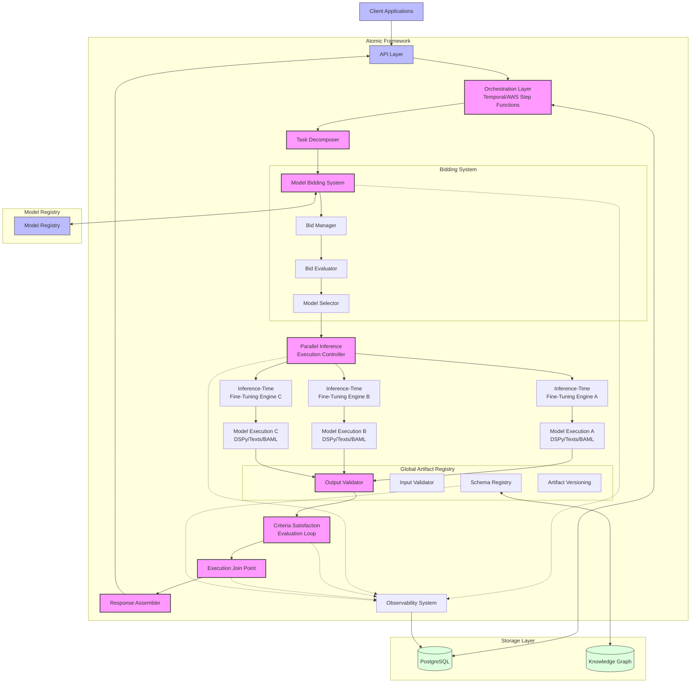
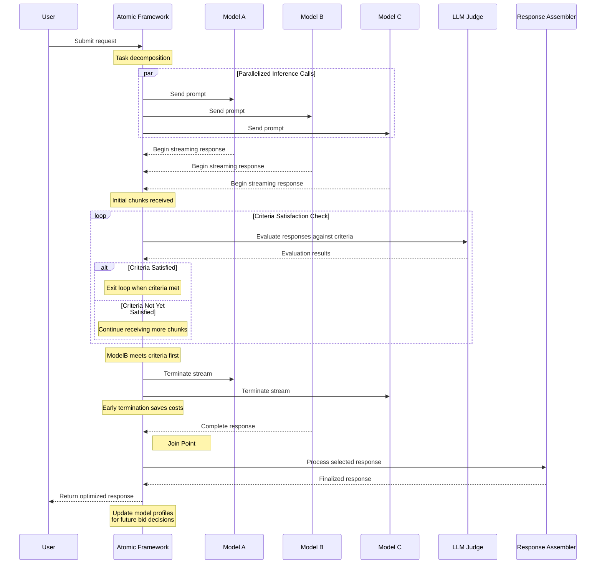
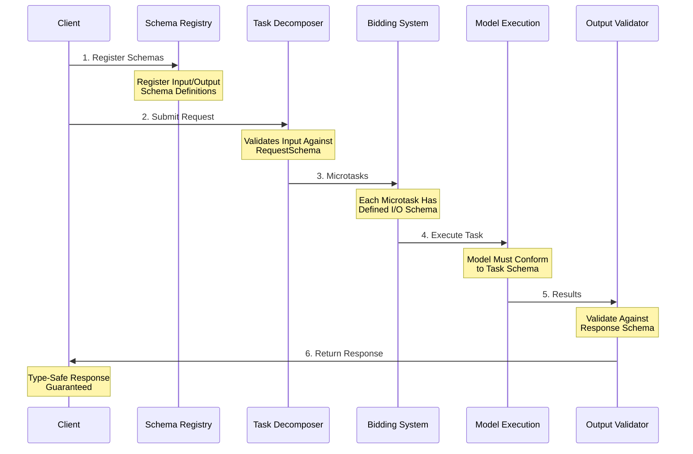

> ⚠️ **Warning**: This project is currently in conceptual phase and not yet implemented. I welcome contributions, ideas and collaboration to help bring this vision to life! If you're interested in getting involved, please feel free to open issues, submit PRs or reach out to discuss.


**Dynamic AI Orchestration with Optimization**

Atomic is an AI orchestration framework that is built to prioritize speed, explainability, reliability, resilience and efficiency.  Future versions will revolutionize model selection and execution through a real-time bidding system.  The future vision will enables AI models to compete to fufill microtasks based on efficiency metrics.  This will all dynamically adapt models at runtime without retraining, and provides comprehensive observability with type-safe outputs.

## 📌 Challenges and limitations of existing solutions

Atomic addresses critical challenges in production AI systems:

- **1. Model Capacity Constraints**: GPU limitations persist and businesses face limited access to high-demand models like Claude and GPT-4, impeding innovation or creating uncertain latency constraints
- **2. Latency Management**: Traditional managed LLM inference can suffer from unpredictable or high latency, compromising user experience and real-time applications like voice, ad exchanges, personalization and ecommerce.
- **3. Black Box Operations**: Many orchestration frameworks that leverage ReAct, Reflexion and CoT (Chain of thought) operate as black boxes, making it difficult to understand decision paths and troubleshoot issues.  This uncertainty can limit entreprise adoption.
- **4. Unpredictable output**: AI systems frequently produce inconsistent or unexpected outputs, creating reliability challenges for production deployments.
- **5. Costly**: Atomic provides dynamic model routing based on real-time performance metrics, ensuring optimal routing to the ideal model to optimize for latency, cost and capacity.
- **6. Resilient Fallbacks**: Automatic fallback mechanisms seamlessly transition to alternative models when primary options fail or underperform based on deterministic evals and performance metrics.
- **7. Resource Optimization**:  Cost management dynamically balances performance needs with budget constraints

## Benefits of Atomic
- **Cost Efficiency**: Automatically select the most efficient model for each specific task
- **Runtime Adaptation**: Fine-tune models at inference time without costly retraining
- **Type Safety and structured output**: Ensure reliable, structured outputs with schema validation
- **Enterprise Readiness**: Support compliant execution for regulated industries
- **Full Observability**: Understand exactly why each model was selected and how it performed through integration with best in class tracing tooling.

## 🏗️ Architecture Overview



The diagram illustrates the key components of Atomic's enhanced architecture:

1. **Client Interface**: Applications interact with Atomic through the API layer
2. **Orchestration Layer**: Coordinates workflow using Temporal or AWS Step Functions
3. **Task Decomposer**: Breaks complex requests into atomic microtasks
4. **Model Bidding System**: Core innovation where models compete for microtasks
5. **Parallel Inference Execution Controller**: Manages concurrent execution of multiple inference paths
6. **Inference-Time Fine-Tuning Engines**: Multiple parallel engines that adapt models at runtime without retraining
7. **Model Execution Engines**: Execute selected models in parallel using frameworks like DSPy, Texts, BAML
8. **Criteria Satisfaction Evaluation Loop**: Continuously evaluates model outputs against defined criteria
9. **Execution Join Point**: Consolidates results from parallel execution paths based on criteria satisfaction
10. **Structured Output Manager**: Ensures type-safe, schema-validated outputs
11. **Response Assembler**: Combines and finalizes the selected model outputs
12. **Observability System**: Provides comprehensive visibility into execution paths, including parallel processing

## Future vision

1. Event driven AI orchestration
2. Dynamic routing
3. Ad network style bidding on microtasks
4. Distributed Web3 based distributed reasoning and intelligence network
5. AGI

## ⚙️ Technology Stack

| **Component**     | **Technology**                     | **Purpose**                                  |
|-------------------|------------------------------------|----------------------------------------------|
| Orchestration     | Temporal OR AWS Step Functions     | Workflow coordination and state management   |
| Execution         | DSPy, Texts, BAML                  | Model execution and prompt engineering       |
| Structured Output | Outlines, BoundaryML BAML          | Type-safe, schema-validated outputs          |
| Model Selection   | RL-Based Bidding System            | Dynamic, cost-optimized model selection      |
| Storage           | PostgreSQL, Knowledge Graphs        | Persistent storage and semantic relationships |
| API & Backend     | Python (FastAPI), Rust, Go         | High-performance, scalable services          |
| Observability     | Structured Logging, Real-Time Dashboards | Complete visibility into execution paths |

## 🔬 How It Works

#### Example: Dynamic Model Selection and Early Termination

The following diagram illustrates how Atomic dynamically selects between models and can terminate underperforming streams:



In this enhanced architecture:
1. Atomic sends the request to multiple models (A, B, and C) in parallel, maximizing inference parallelization
2. All models begin streaming their responses simultaneously
3. The system enters a criteria satisfaction loop where:
   - An LLM judge continuously evaluates incoming response chunks against defined criteria
   - The loop continues until one or more responses meet the quality criteria
   - This approach ensures optimal quality while minimizing latency
4. Once Model B meets the criteria, other model streams are terminated early
5. At the join point, the selected response is processed by the Response Assembler
6. The finalized response is returned to the user
7. The system updates its model profiles to inform future bidding decisions

This architecture with parallelized inference, criteria satisfaction loop, and explicit join point significantly improves efficiency, reduces costs, and maintains high response quality through continuous evaluation.

### Inference-Time Fine-Tuning

Atomic enables models to adapt at runtime without requiring full retraining:

- **Context-Aware Adaptation**: Models adjust to specific requirements on-the-fly
- **Dynamic Parameter Optimization**: Tune model parameters based on task context
- **Continuous Learning**: Apply execution feedback to improve future performance

### Structured AI Output with Type Safety

Ensure reliable, validated outputs through:

- **Schema Enforcement**: Define expected output structures with Outlines
- **Runtime Validation**: Verify outputs match defined schemas before returning results
- **Type-Safe Integration**: Enable seamless integration with downstream systems

# Implementation Plan

## For consideration:
* Redis, SQS, SNS
* Temporal, Step Functions
* gRPC, protobuff, JSON, AVO
* Rust, Go

## Observability/Tracing
* OpenTelemetry
* Prometheus, Grafana

## Deployment
* k8
* Terraform

## Client Libraries
* Python
* TypeScript
* Java

## Storage
* Bloom filters with Apache Cassandra, Apache HBase, Redis, or Apache Parquet. 

### Comprehensive Observability

Gain complete visibility into model selection and execution:

- **Decision Transparency**: Understand exactly why each model was selected
- **Performance Metrics**: Track accuracy, latency, and cost across all executions
- **Real-Time Monitoring**: Visualize system performance through live dashboards

## 🛣️ Roadmap

### 🔵 Phase 1: Concept Development (Completed)
- [x] Define core architecture
- [x] Research bidding strategies
- [x] Prototype inference-time fine-tuning

### 🟢 Phase 2: Prototype Implementation
- [ ] Implement bidding engine
- [ ] Develop initial model selection pipeline
- [ ] Set up structured execution logging

### 🟡 Phase 3: Scaling & Optimization
- [ ] Optimize real-time bidding for microtasks
- [ ] Fine-tune inference-time model selection
- [ ] Expand observability & debugging tools

### 🔴 Phase 4: Production Readiness
- [ ] Deploy on on-premise & cloud environments
- [ ] Harden security & governance compliance
- [ ] Conduct real-world AI workload testing

### 🟣 Phase 5: Sovereign Clean Room Execution
- [ ] Establish "clean room" environment for model execution under a sovereign party
- [ ] Ensure data isolation and guaranteed safety
- [ ] Provide advanced compliance frameworks for regulated industries

## 📊 Comparison with Existing Tools

| Feature                      | **Atomic** | LangChain | LlamaIndex | CrewAI | Flowwise |
|-----------------------------|:---------:|:--------:|:---------:|:------:|:-------:|
| Inference-Time Fine-Tuning  | ✅ Yes     | ❌ No     | ❌ No     | ❌ No  | ❌ No    |
| Bid-Based Model Selection   | ✅ Yes     | ❌ No     | ❌ No     | ❌ No  | ❌ No    |
| Explainability & Debugging  | ✅ Yes     | ❌ Limited| ❌ Limited| ❌ No  | ❌ No    |
| Speed Optimization          | ✅ Yes     | ❌ No     | ❌ No     | ❌ No  | ❌ No    |
| Type-Safe Structured Output | ✅ Yes     | ❌ No     | ❌ No     | ❌ No  | ❌ No    |
| On-Premise Support          | ✅ Yes     | ❌ No     | ❌ No     | ❌ No  | ❌ No    |

### Key Differentiators

Atomic represents the next generation of AI orchestration tools:

1. **Dynamic Model Selection**: Unlike static chains in existing frameworks, Atomic dynamically selects the optimal model for each specific task through its bidding system.

2. **Runtime Adaptation**: While other frameworks require separate fine-tuning steps, Atomic adapts models during execution without retraining.

3. **Enterprise Readiness**: Designed for regulated industries with sovereign clean room execution, enabling compliant AI operations.

4. **Complete Observability**: Provides transparent reasoning for every model selection decision and comprehensive execution metrics.

5. **Cost Optimization**: Automatically balances performance and cost through its bidding system, reducing operational expenses.

## 🔍 Example: Automated Email Processing

Atomic can power intelligent email processing systems with:

- **Smart Classification**: Dynamically select specialized models for different email types
- **Adaptive Responses**: Tune response generation based on email context
- **Cost Efficiency**: Use minimal models for routine emails, premium models for complex cases
- **Full Traceability**: Track the entire decision process from receipt to response

```
┌───────────────────────────────┐
│ 1. Incoming Email             │
│    (Inbox Event Trigger)      │
└───────────────┬───────────────┘
                ▼
┌───────────────────────────────┐
│ 2. Preprocessing & Routing    │
│    (Parse email content)      │
└───────────────┬───────────────┘
                ▼
┌───────────────────────────────┐
│ 3. Model Bidding System       │
│    (Microtask bids for:       │
│    categorization, sentiment, │
│    spam detection, etc.)      │
└───────────────┬───────────────┘
                ▼
┌───────────────────────────────┐
│ 4. Inference-Time Fine-Tuning │
│    (Adaptive response setup)  │
└───────────────┬───────────────┘
                ▼
┌───────────────────────────────┐
│ 5. Model Execution Engine     │
│    (Generate structured       │
│    response via BAML)         │
└───────────────┬───────────────┘
                ▼
┌───────────────────────────────┐
│ 6. Observability & Logging    │
│    (Trace reasons for model   │
│    selection, final response) │
└───────────────┬───────────────┘
                ▼
┌───────────────────────────────┐
│ 7. Automated Reply / Action   │
│    (Send response, tag email, │
│    trigger further workflows) │
└───────────────────────────────┘
```

## Future components

### Model Bidding System

The core innovation of Atomic is its real-time bidding system where models compete for microtasks:

1. **Task Decomposition**: Break complex requests into atomic microtasks
2. **Bid Collection**: Models submit bids based on confidence, cost, and latency
3. **Optimal Selection**: The bidding system selects the most efficient model for each task
4. **Performance Tracking**: Results feed back into future bidding decisions

This approach is inspired by ad exchanges but optimized for AI model execution, ensuring each task is handled by the most appropriate model.


## 🚀 Getting Started

*Coming soon - project currently in concept development phase*

## 📄 License

This project is licensed under the MIT License - see the [LICENSE](LICENSE) file for details.

## 🤝 Contributing

Contributions are welcome! See [CONTRIBUTING.md](CONTRIBUTING.md) for details.

## 🔬 Global Artifact Schema Registry

The Global Artifact Schema Registry is a central component that ensures type safety and data consistency across the entire system:

### Core Components

1. **Schema Registry**
   - Centralized repository for all input/output schemas
   - Version control for schema evolution
   - Compatibility checking between versions
   - Integration with popular schema formats (Protobuf, Avro, JSON Schema)

2. **Input/Output Validators**
   - Runtime validation of all artifacts
   - Schema enforcement at system boundaries
   - Automatic type conversion and normalization
   - Error handling and validation feedback

3. **Artifact Versioning**
   - Semantic versioning for all artifacts
   - Backward/forward compatibility checks
   - Migration tools for schema evolution
   - Version dependency management

### Schema Definition Example

```typescript
// Example of a schema definition using TypeScript-like syntax
interface EmailAnalysisInput {
  sender: string;
  recipient: string;
  subject: string;
  body: string;
  metadata: {
    timestamp: DateTime;
    priority?: number;
    tags?: string[];
  };
}

interface EmailAnalysisOutput {
  category: EmailCategory;
  sentiment: SentimentLevel;
  priority: number;
  suggestedAction: ActionType;
  confidence: number;
  metadata: {
    modelId: string;
    executionTime: number;
    cost: number;
  };
}

// Enum definitions
enum EmailCategory {
  SUPPORT = 'support',
  SALES = 'sales',
  COMPLAINT = 'complaint',
  INQUIRY = 'inquiry',
  SPAM = 'spam'
}

enum SentimentLevel {
  POSITIVE = 'positive',
  NEUTRAL = 'neutral',
  NEGATIVE = 'negative'
}

enum ActionType {
  URGENT_RESPONSE = 'urgent_response',
  STANDARD_RESPONSE = 'standard_response',
  FLAG_FOR_REVIEW = 'flag_for_review',
  ARCHIVE = 'archive'
}
```

### Benefits

1. **Type Safety**
   - Guaranteed consistency between components
   - Early detection of interface mismatches
   - Automated type checking and validation

2. **Documentation**
   - Self-documenting interfaces
   - Generated API documentation
   - Clear contract between components

3. **Evolution**
   - Safe schema evolution
   - Backward compatibility checking
   - Automated migration support

4. **Integration**
   - Language-agnostic schema definitions
   - Multi-format support (JSON, Protobuf, Avro)
   - Easy integration with existing tools

### Technology Stack

| Component | Technology |
|-----------|------------|
| Schema Storage | PostgreSQL |
| Versioning | Git-based |
| Validation | JSON Schema + Custom |
| API | GraphQL |
| Cache | Redis |

## 🔄 Artifact Flow & Schema Validation

Every operation in Atomic is defined by strictly typed artifacts that flow through the system. Each component consumes and produces artifacts that must conform to registered schemas.

### Artifact Flow Example



### Key Artifact Types

1. **Request Artifacts**
   ```typescript
   interface RequestArtifact<T> {
     id: string;
     timestamp: DateTime;
     input: T;  // Generic input type
     metadata: RequestMetadata;
     validationSchema: string;  // Schema ID
   }
   ```

2. **Microtask Artifacts**
   ```typescript
   interface MicrotaskArtifact {
     id: string;
     parentRequestId: string;
     inputSchema: SchemaDefinition;
     outputSchema: SchemaDefinition;
     constraints: TaskConstraints;
     deadline?: DateTime;
   }
   ```

3. **Model Execution Artifacts**
   ```typescript
   interface ExecutionArtifact {
     taskId: string;
     modelId: string;
     input: unknown;  // Validated against inputSchema
     output: unknown;  // Must conform to outputSchema
     metrics: ExecutionMetrics;
     validationResults: ValidationResult[];
   }
   ```

4. **Response Artifacts**
   ```typescript
   interface ResponseArtifact<T> {
     requestId: string;
     timestamp: DateTime;
     output: T;  // Generic output type
     metadata: ResponseMetadata;
     validationStatus: ValidationStatus;
   }
   ```

### Schema Validation Points

1. **Request Ingestion**
   - Validates incoming request structure
   - Ensures required fields are present
   - Normalizes data types
   ```typescript
   // Example validation
   const validatedRequest = await schemaRegistry.validate(
     'email-analysis-request-v1',
     incomingRequest
   );
   ```

2. **Task Decomposition**
   - Validates microtask definitions
   - Ensures input/output schema compatibility
   ```typescript
   // Example microtask schema check
   const isCompatible = await schemaRegistry.checkCompatibility(
     sourceSchema,
     targetSchema
   );
   ```

3. **Model Execution**
   - Validates model inputs
   - Ensures output conformance
   ```typescript
   // Example model output validation
   const validatedOutput = await outputValidator.validate(
     modelOutput,
     taskSchema
   );
   ```

4. **Response Assembly**
   - Validates final response
   - Ensures all required data is present
   ```typescript
   // Example response validation
   const validatedResponse = await schemaRegistry.validate(
     'email-analysis-response-v1',
     assembledResponse
   );
   ```

### Schema Evolution

1. **Version Management**
   ```typescript
   interface SchemaVersion {
     id: string;
     version: string;
     definition: SchemaDefinition;
     compatibility: CompatibilityMode;
     migrations: SchemaMigration[];
   }
   ```

2. **Compatibility Modes**
   - `BACKWARD` - New schema can read old data
   - `FORWARD` - Old schema can read new data
   - `FULL` - Both backward and forward compatible
   - `NONE` - Breaking change

3. **Migration Support**
   ```typescript
   interface SchemaMigration {
     sourceVersion: string;
     targetVersion: string;
     migrationScript: string;
     validationTests: MigrationTest[];
   }
   ```

### Benefits of Strict Artifact Typing

1. **Reliability**
   - Catch errors early in the pipeline
   - Prevent invalid data propagation
   - Ensure consistent data structures

2. **Maintainability**
   - Self-documenting interfaces
   - Clear component boundaries
   - Easy schema evolution

3. **Observability**
   - Track artifact lineage
   - Monitor schema violations
   - Debug data flow issues

4. **Security**
   - Validate data at system boundaries
   - Prevent injection attacks
   - Ensure data integrity

### Example: Email Analysis Pipeline

```typescript
// 1. Define Request Schema
interface EmailAnalysisRequest {
  email: EmailInput;
  analysisType: AnalysisType[];
  priority: Priority;
}

// 2. Define Microtask Schemas
interface SentimentAnalysisTask {
  input: { text: string };
  output: { sentiment: Sentiment; confidence: number };
}

// 3. Define Model Output Schema
interface ModelOutput {
  results: AnalysisResult[];
  metadata: ExecutionMetadata;
  confidence: number;
}

// 4. Define Response Schema
interface EmailAnalysisResponse {
  analysis: AnalysisResult[];
  recommendations: Action[];
  metadata: ResponseMetadata;
}

// Usage Example
async function processEmail(request: EmailAnalysisRequest): Promise<EmailAnalysisResponse> {
  // 1. Validate request
  const validatedRequest = await schemaRegistry.validate('email-request-v1', request);

  // 2. Decompose into microtasks
  const tasks = await taskDecomposer.decompose(validatedRequest);

  // 3. Execute and validate each task
  const results = await Promise.all(
    tasks.map(async task => {
      const result = await modelExecutor.execute(task);
      return outputValidator.validate(result, task.outputSchema);
    })
  );

  // 4. Assemble and validate response
  const response = responseAssembler.assemble(results);
  return schemaRegistry.validate('email-response-v1', response);
}
```
